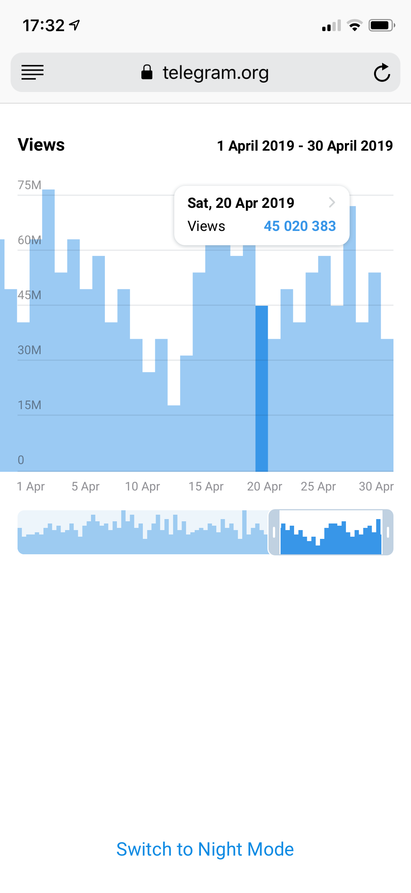
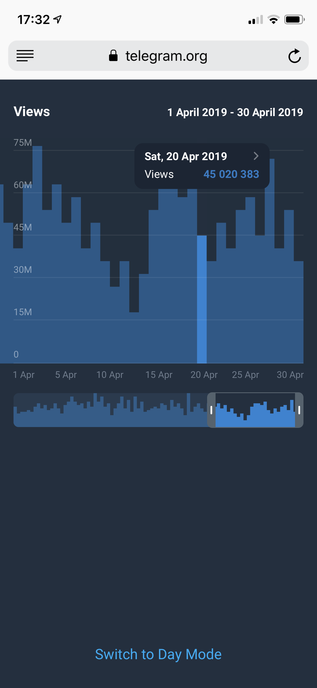
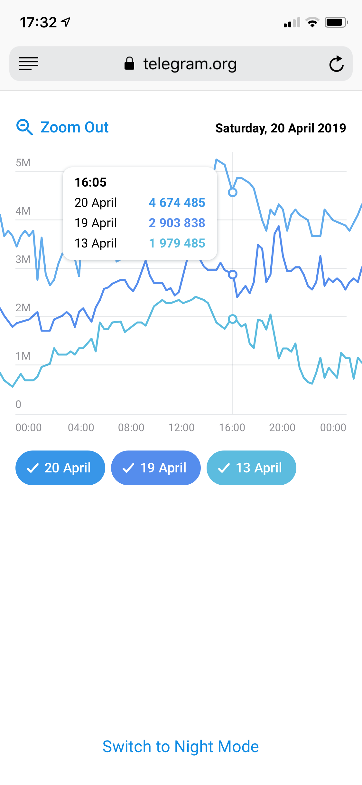
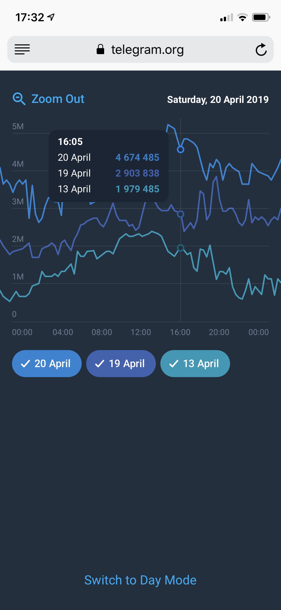

# Stage 2 - Chart 4

## 4. A daily bar chart with single data type (Screenshot 7).
 > Bonus goal:
 >
 > A daily bar chart with a single data type zooms into a line chart with 3 lines (the other two lines can represent values from 1 day and 1 week ago, as shown on Screenshot 8). Please see the second video demonstration below.

Day                        |  Night
:-------------------------:|:-------------------------:
   |  
   |  
