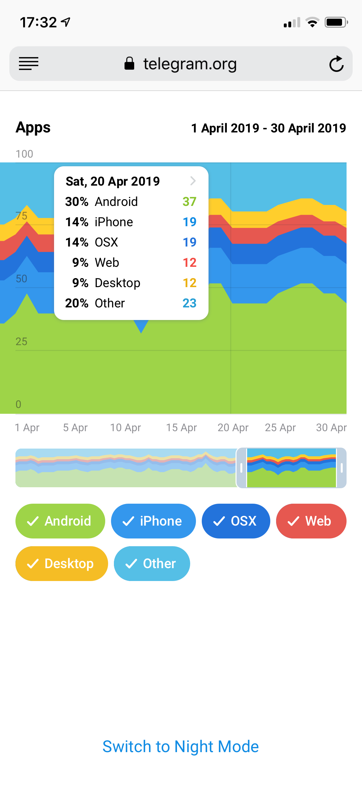
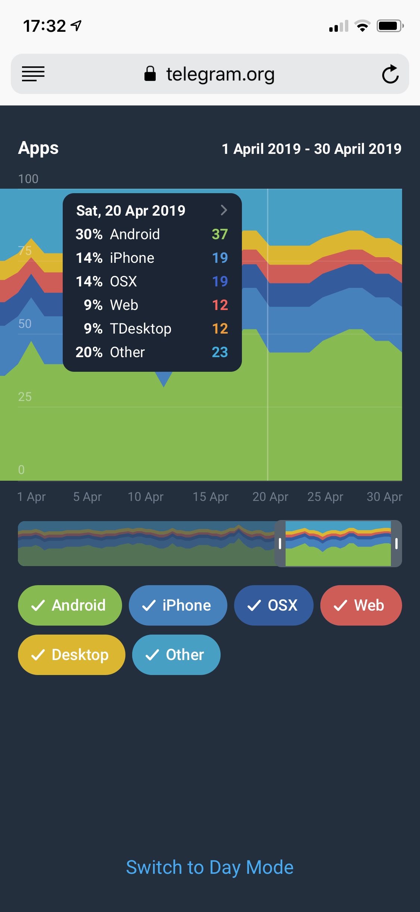
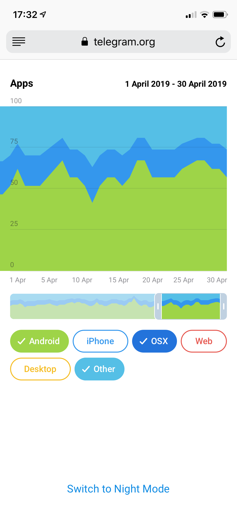
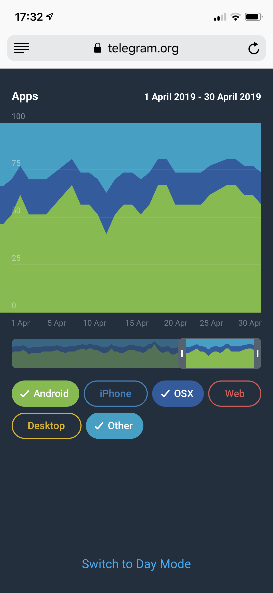
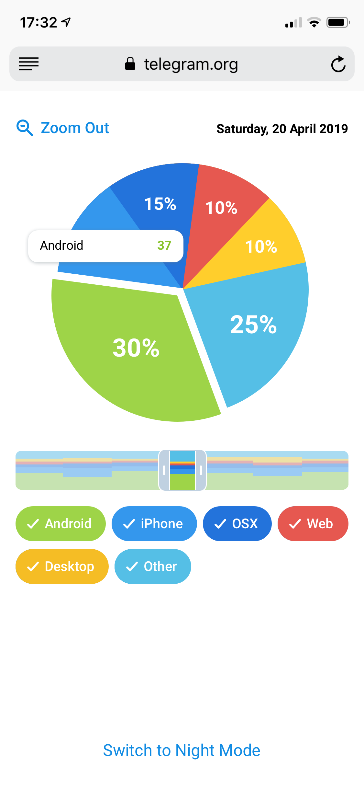
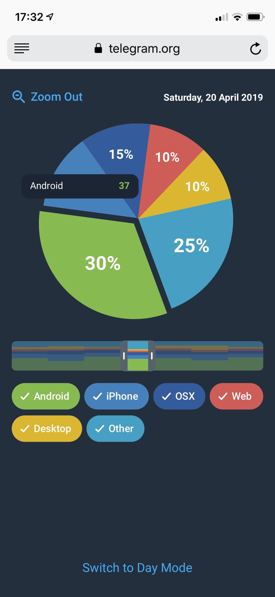

# Stage 2 - Chart 5

## 5. A percentage stacked area chart with 6 data types (Screenshots 9, 10).
 > Bonus goal:
 >
 > A percentage stacked area chart with 6 data types that zooms into a pie chart with average values for the selected period (Screenshot 11).
 > See the [third video](https://t.me/contest/63) demonstration.

Day                        |  Night
:-------------------------:|:-------------------------:
   |  
   |  
   |  
